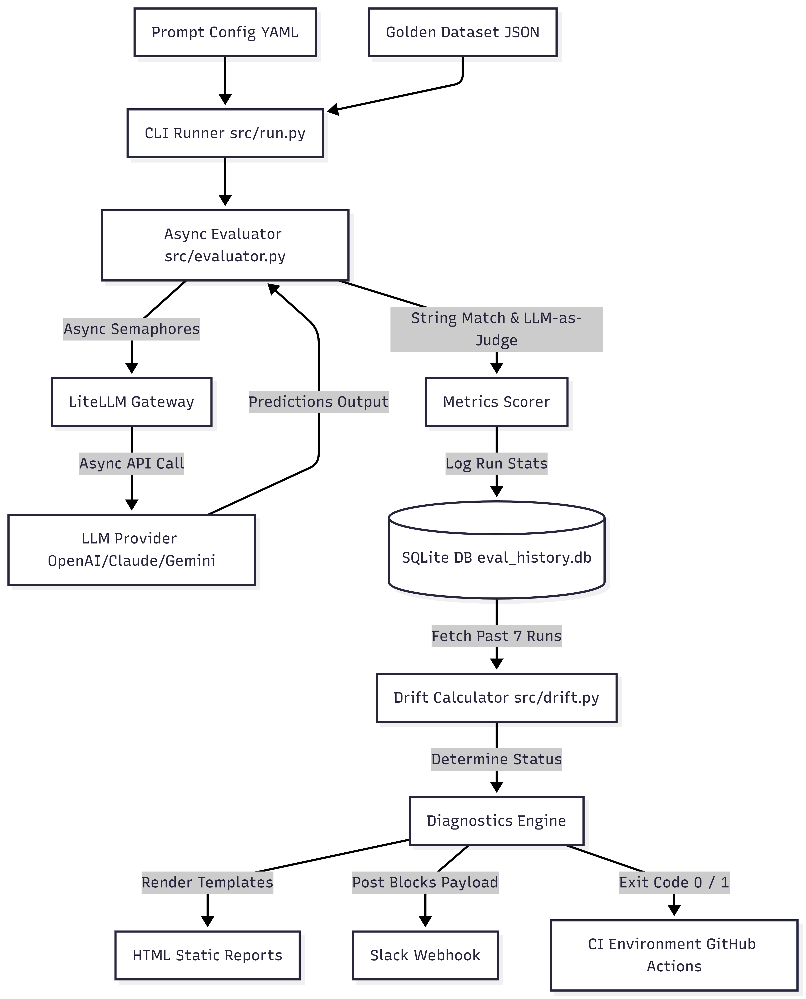

# Internal Onboarding: Model Regression Detection System

This repository hosts our continuous integration evaluation pipeline for LLM-powered features. The system tests our Customer Support Email Classifier prompt configurations and model choices against a versioned golden dataset. It tracks categorization accuracy, summary relevance (via LLM-as-judge), latency, and API costs, preventing model regressions and slow performance drift from reaching production users.

---

## System Architecture & Data Flow

This diagram visualizes how prompt adjustments run through the evaluation suite and generate diagnostics:



---

## Detailed Technical Specifications

### 1. Async Concurrency & Semaphore Rate Limiting
To prevent hitting API rate limits (TPM/RPM errors) when running evaluations on large golden datasets, the evaluator engine implements concurrent asynchronous execution via Python's `asyncio.Semaphore`. The semaphore limits the number of active connection channels (defaulting to 5 simultaneous requests). This optimizes connection pooling and execution speed (averaging ~2 seconds for 50 parallel runs) without hitting rate limit blockades.

### 2. Multi-Dimensional Semantic Scoring (LLM-as-Judge)
Category validation is solved with exact string mapping. However, user-facing summary quality is non-deterministic. To evaluate summaries, the pipeline feeds the original input email, the human-written expected summary, and the model's generated summary into a separate **LLM-as-Judge** instance (`gpt-4o-mini`). The judge grades the summary on a strict 1.0 to 5.0 rubric (capturing details, checking length, and scanning for pleasantries) and returns structured JSON containing the rating and audit reason.

### 3. Dynamic Baseline Reconstruction (GitOps CI)
Rather than maintaining a persistent cloud database (S3/DynamoDB) to reference the baseline statistics in remote GitHub runners, we use Git. The workflow stashes local changes, checkouts the base branch (e.g. `main`), executes the evaluation script on the baseline configurations to populate the runner's workspace SQLite DB, and then restores the workspace to run the PR evaluations. This guarantees a completely secure and zero-infrastructure environment.

### 4. Rolling-Window Performance Drift Auditing
Prompt refactoring often results in minor performance fluctuations (e.g., ±2%) that might pass individual evaluations. To catch slow, creeping decay, the drift detection engine checks the last 7 runs from SQLite. It calculates the rolling average for category accuracy and relevance, and sounds an alert if the rolling average drops significantly (default 4.0%) below the active baseline, signaling gradual model drift.

---

## Architecture & Design Decisions

### 1. Zero-Infrastructure State Store (SQLite & JSON)
*   **Decision**: We use a local SQLite database (`data/eval_history.db`) for run metrics and a versioned JSON file (`data/golden_dataset.json`) for the test suite.
*   **Rationale**: Eliminates the cost, latency, and maintenance overhead of running external databases. SQLite is serverless, portable, and git-friendly. The golden dataset is tracked in Git, ensuring that changes to the evaluation standard are visible via Pull Request diffs.

### 2. Git-Diff Dynamic Baseline Reconstruction (GitOps CI)
*   **Decision**: Instead of keeping a persistent cloud database (like DynamoDB or S3) to track the "active baseline" run in CI, the GitHub Actions runner reconstructs the baseline on the fly.
*   **Rationale**: The runner checkouts the target branch (e.g. `main`), runs the baseline prompt (`v1.yaml`) to populate the SQLite database, and then runs the current PR branch prompts to perform the delta diagnostics. This makes the CI pipeline entirely self-contained, secure, and infrastructure-free.

### 3. Multi-Dimensional Quality Scoring
*   **Decision**: Evaluation is scored on both classification accuracy (exact binary match) and summary relevance (1.0 to 5.0 score graded via an async LLM-as-judge).
*   **Rationale**: A prompt modification can maintain a 95% category match rate while severely degrading the user-facing summary quality. Evaluating both dimensions catches semantic regressions.

### 4. Dual Live/Mock Execution Modes
*   **Decision**: If all supported LLM API keys (such as `OPENAI_API_KEY`, `ANTHROPIC_API_KEY`, `GEMINI_API_KEY`, `COHERE_API_KEY`, `GROQ_API_KEY`) are missing, or if `OPENAI_API_KEY` contains `mock`, the pipeline defaults to Mock Mode. Prompt `v2.yaml` is programmed to trigger a regression in mock mode.
*   **Rationale**: Enables developer onboarding, pipeline adjustments, and system demos without incurring API billing or requiring API key provisioning.

### 5. Multi-Provider Abstraction (LiteLLM)
*   **Decision**: We route all completion calls through LiteLLM.
*   **Rationale**: Allows us to benchmark and switch between models from different providers (e.g. `openai/gpt-4o-mini`, `anthropic/claude-3-5-sonnet-20240620`, `gemini/gemini-1.5-flash`, or local `ollama/llama3`) simply by changing the `model` string in the prompt configuration YAML files. No codebase modifications are necessary when switching providers.

---

## Getting Started

### Local Setup
1.  **Clone the workspace** and navigate to this folder.
2.  **Install dependencies**:
    ```bash
    pip install -r requirements.txt
    ```
3.  **Seed the Golden Dataset**:
    ```bash
    python data/seed_dataset.py
    ```

### Running Evaluations
Ensure you are in the project root folder.

*   **Establish Baseline (V1 Prompt)**:
    ```bash
    python -m src.run --prompt prompts/v1.yaml --baseline
    ```
*   **Evaluate Prompt Changes (V2 Prompt)**:
    ```bash
    python -m src.run --prompt prompts/v2.yaml
    ```
*   **Customize Thresholds**:
    ```bash
    python -m src.run --prompt prompts/v2.yaml --warning-threshold 2.0 --critical-threshold 5.0
    ```

*Note: The CLI returns exit code `1` on a critical regression, blocking integrations when run inside CI pipelines.*

---

## Configuration & Customization

### 1. Tuning Thresholds
*   `--warning-threshold`: Percentage drop in category accuracy (e.g. `3.0`) vs baseline that fires a Slack warning.
*   `--critical-threshold`: Percentage drop (e.g. `8.0`) that fails the CI runner.
*   `--drift-threshold`: Percentage drop in the **7-run rolling average** (e.g. `4.0`) below the baseline that fires a "slow drift" warning.

### 2. Expanding the Golden Dataset
*   **Adding cases**: Modify `data/seed_dataset.py` directly, add entries to the `test_cases` list, and re-run `python data/seed_dataset.py`.
*   **Contracts**: Every test case requires:
    - `id`: Unique string (e.g., `case_bill_014`).
    - `input`: The raw customer email body.
    - `expected_category`: Must match one of `billing`, `technical`, `account`, or `general`.
    - `expected_summary`: Human ground-truth one-sentence summary.
    - `expected_difficulty`: `easy`, `medium`, or `hard` (determines mock scoring and facilitates dashboard sorting).

### 3. Monitoring via Streamlit Dashboard
To explore historical evaluations and compare test case regressions interactively:
```bash
streamlit run dashboard.py
```
*   **Marking Baselines**: The dashboard includes a button on the sidebar to promote any historical run to be the new active baseline.

---

## CI/CD Environment Variables
Provision the appropriate credentials in GitHub repository settings to connect live pipelines:
*   `OPENAI_API_KEY`: Required when benchmarking OpenAI models (e.g. `gpt-4o-mini`).
*   `ANTHROPIC_API_KEY`: Required when benchmarking Anthropic models (e.g. `claude-3-5-sonnet-20240620`).
*   `GEMINI_API_KEY`: Required when benchmarking Google Gemini models (e.g. `gemini/gemini-1.5-flash`).
*   `SLACK_WEBHOOK_URL`: Slack incoming webhook channel connector for automated team notifications.

---

## CI/CD Pipeline Integration (GitHub Actions)

We have pre-configured a complete GitOps-style pipeline in [.github/workflows/eval_ci.yml](file:///.github/workflows/eval_ci.yml) that automates prompt regression audits.

### Workflow Orchestration
1.  **Triggers**: The pipeline executes on every `push` and `pull_request` affecting the following directories:
    *   `prompts/**` (YAML prompt updates)
    *   `data/**` (test dataset alterations)
    *   `src/**` (classifier or scoring upgrades)
2.  **Dynamic Baseline Checkouts**: To eliminate external database infrastructure, the runner uses Git to check out the base branch (e.g., `main`), builds the baseline SQLite DB on the fly with the active baseline prompt configuration, and then executes the evaluation on the current PR code.
3.  **Threshold Validation & Exit Codes**:
    *   If a category accuracy drop exceeds the configurable `--critical-threshold` (default `8.0%`), the CLI runner exits with code `1`, causing the GitHub Actions build step to fail and block the Pull Request merge.
    *   Other results exit with `0` (warnings and passing scores).
4.  **HTML Diagnostical Artifacts**:
    *   On every pipeline execution, the visual HTML diff reports are archived under the build execution dashboard. You can download and inspect the `model-regression-report` zip containing the detailed side-by-side tables.
5.  **Slack Alert Integration**:
    *   If the secret `SLACK_WEBHOOK_URL` is set, the channel will instantly receive a Block Kit message with warnings, metrics drops, and references to the running job ID.

